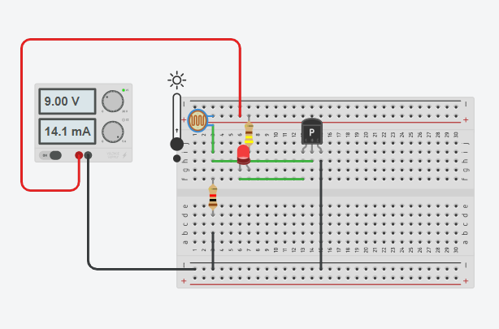
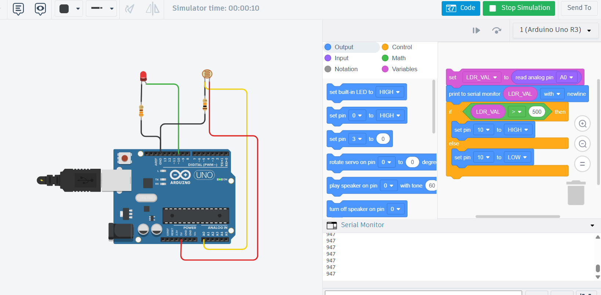

# All Electronics Tasks

Unified portfolio of electronics laboratory reports, presentations, and
engineering projects published on [SlideShare](https://www.slideshare.net/ulkereliyeva800),
[Academia.edu](https://www.academia.edu/), and [Notion](https://www.notion.so/).
Each topic includes a `.txt` file with its description; SlideShare topics also
include the original PDF, and engineering projects include their full source
files (docx, ino, images).

## Index

| # | Topic | Link | Authors | Verified |
|---|-------|------|---------|----------|
| 01 | Technical Laboratory Report: Inductor | [link](https://www.slideshare.net/slideshow/technical-laboratory-report-inductor-ulker-aliyeva-nazile-aliyeva-verified-by-physics-teacher-azerbaijan-telman-askeraliyev-fizika-muellimi-azerbaijan-baku/287498677) | Ulker Aliyeva · Nazile Aliyeva | verified by: physics teacher azerbaijan telman askeraliyev (fizika muellimi) – contact: [LinkedIn](https://www.linkedin.com/in/physics-teacher-azerbaijan-telman-askeraliyev/) · [Instagram](https://www.instagram.com/physics_teacher_azerbaijan) |
| 02 | Audit: ELV / LV Designer Job Listing — Gaps & Recommendations | [link](https://www.slideshare.net/slideshow/audit-elv-lv-designer-job-listing-4-gaps-recommendations-by-ulker-aliyeva-and-ali-shukurov-verified-by-physics-teacher-azerbaijan-telman-askeraliyev-fizika-muellimi-azerbaijan-baku/287388816) | Ulker Aliyeva · Ali Shukurov | verified by: physics teacher azerbaijan telman askeraliyev (fizika muellimi) – contact: [LinkedIn](https://www.linkedin.com/in/physics-teacher-azerbaijan-telman-askeraliyev/) · [Instagram](https://www.instagram.com/physics_teacher_azerbaijan) |
| 03 | Technical Laboratory Report: Amplifier | [link](https://www.slideshare.net/slideshow/technical-laboratory-report-amplifier-ulker-aliyeva-nazile-aliyeva-verified-by-physics-teacher-azerbaijan-telman-askeraliyev-fizika-muellimi-azerbaijan-baku/287037036) | Ulker Aliyeva · Nazile Aliyeva | verified by: physics teacher azerbaijan telman askeraliyev (fizika muellimi) – contact: [LinkedIn](https://www.linkedin.com/in/physics-teacher-azerbaijan-telman-askeraliyev/) · [Instagram](https://www.instagram.com/physics_teacher_azerbaijan) |
| 04 | Technical Laboratory Report: Transistor | [link](https://www.slideshare.net/slideshow/technical-laboratory-report-transistor-ulker-aliyeva-nazile-aliyeva-fazil-isgender-ali-shukurov-verified-by-physics-teacher-azerbaijan-telman-askeraliyev-fizika-muellimi-azerbaijan-baku-5488/286914741) | Ulker Aliyeva · Nazile Aliyeva · Fazil Isgender · Ali Shukurov | verified by: physics teacher azerbaijan telman askeraliyev (fizika muellimi) – contact: [LinkedIn](https://www.linkedin.com/in/physics-teacher-azerbaijan-telman-askeraliyev/) · [Instagram](https://www.instagram.com/physics_teacher_azerbaijan) |
| 05 | Capacitor | [link](https://www.slideshare.net/slideshow/capacitor-description-ulkar-aliyeva-imran-cherchiyev-xaqani-cafarli-pptx/286799787) | Ulkar Aliyeva · Imran Cherchiyev · Xaqani Cafarli | verified by: physics teacher azerbaijan telman askeraliyev (fizika muellimi) – contact: [LinkedIn](https://www.linkedin.com/in/physics-teacher-azerbaijan-telman-askeraliyev/) · [Instagram](https://www.instagram.com/physics_teacher_azerbaijan) |
| 06 | Technical Laboratory Report: Voltage Regulator | [link](https://www.slideshare.net/slideshow/technical-laboratory-report-voltage-regulator-ulker-aliyeva-nazile-aliyeva-fazil-isgender-verified-by-physics-teacher-azerbaijan-telman-askeraliyev-fizika-muellimi-azerbaijan-baku/287505121) | Ulker Aliyeva · Nazile Aliyeva · Fazil Isgender | verified by: physics teacher azerbaijan telman askeraliyev (fizika muellimi) – contact: [LinkedIn](https://www.linkedin.com/in/physics-teacher-azerbaijan-telman-askeraliyev/) · [Instagram](https://www.instagram.com/physics_teacher_azerbaijan) |
| 07 | Technical Laboratory Report: Light-Sensitive Switch (LDR & Voltage Divider) | [link](https://www.academia.edu/166125872/Technical_Laboratory_Report_The_Light_Sensitive_Switch_LDR_Voltage_Divider) | Ulker Aliyeva · Nazile Aliyeva · Fazil Isgender | verified by: physics teacher azerbaijan telman askeraliyev (fizika muellimi) – contact: [LinkedIn](https://www.linkedin.com/in/physics-teacher-azerbaijan-telman-askeraliyev/) · [Instagram](https://www.instagram.com/physics_teacher_azerbaijan) |
| 08 | Electronics Project — 12/03 | [link](https://www.notion.so/Electronics-project-12-03-321bd0fa66d980c0862fe754a10fa3b2) | Ulker Aliyeva · Nazile Aliyeva · Fazil Isgender | verified by: physics teacher azerbaijan telman askeraliyev (fizika muellimi) – contact: [LinkedIn](https://www.linkedin.com/in/physics-teacher-azerbaijan-telman-askeraliyev/) · [Instagram](https://www.instagram.com/physics_teacher_azerbaijan) |
| 09 | Physics Guide: Field Effect Transistors (FETs) | [link](https://www.slideshare.net/slideshow/pyysics-guide-field-effect-transistors-fets-nazrin-aliyeva-ulkar-aliyeva-nazila-aliyeva-ali-shukurov/287153252) | Nazrin Aliyeva · Ulkar Aliyeva · Nazila Aliyeva · Ali Shukurov · Fazil Isgandar | verified by: physics teacher azerbaijan telman askeraliyev (fizika muellimi) – contact: [LinkedIn](https://www.linkedin.com/in/physics-teacher-azerbaijan-telman-askeraliyev/) · [Instagram](https://www.instagram.com/physics_teacher_azerbaijan) |
| 10 | Automatic Street Light — Engineering Project | [Project 1 (Transistor)](https://www.academia.edu/167305288/Technical_Laboratory_Report_Automatic_Street_Light_Using_Transistor_and_Photoresistor_by_Ulker_Aliyeva_Verified_by_Physics_Teacher_Azerbaijan_Telman_Askeraliyev_Fizika_Muellimi_Azerbaijan_Baku_) · [Project 2 (Arduino)](https://www.academia.edu/167305330/Technical_Laboratory_Report_Automatic_Street_Light_Using_Arduino_and_Photoresistor_by_Ulker_Aliyeva_Verified_by_Physics_Teacher_Azerbaijan_Telman_Askeraliyev_Fizika_Muellimi_Azerbaijan_Baku_) | Ulker Aliyeva | verified by: physics teacher azerbaijan telman askeraliyev (fizika muellimi) – contact: [LinkedIn](https://www.linkedin.com/in/physics-teacher-azerbaijan-telman-askeraliyev/) · [Instagram](https://www.instagram.com/physics_teacher_azerbaijan) |
| 11 | Automatic Street Light — Project Demo Video | [YouTube](https://www.youtube.com/watch?v=9EYs5fDXG94) | Ulker Aliyeva | verified by: physics teacher azerbaijan telman askeraliyev (fizika muellimi) – contact: [LinkedIn](https://www.linkedin.com/in/physics-teacher-azerbaijan-telman-askeraliyev/) · [Instagram](https://www.instagram.com/physics_teacher_azerbaijan) |

---

--------------------
1.Topic

https://www.slideshare.net/slideshow/technical-laboratory-report-inductor-ulker-aliyeva-nazile-aliyeva-verified-by-physics-teacher-azerbaijan-telman-askeraliyev-fizika-muellimi-azerbaijan-baku/287498677

verified by: physics teacher azerbaijan telman askeraliyev (fizika muellimi) – contact: https://www.linkedin.com/in/physics-teacher-azerbaijan-telman-askeraliyev/
https://www.instagram.com/physics_teacher_azerbaijan

# Inductors in Electronics — Technical Laboratory Report

A 10-slide technical laboratory report on inductors and their behaviour in
electronic circuits, prepared as part of an Electronics & Circuit Theory
laboratory module.

**Authors:** Ulker Aliyeva · Nazile Aliyeva
**Verified by:** Telman Askeraliyev — Physics Teacher, Azerbaijan, Baku (Fizika Muellimi)

---

## Topics Covered

- Inductor fundamentals — energy stored in a magnetic field
- Lenz's Law and back-EMF behaviour
- Inductance units — Henry (H), mH, μH
- Magnetic flux: `Φ = L · I`
- Stored energy: `W = (1/2) · L · I²`
- Common inductor types (Air, Iron, Ferrite, Toroidal cores)
- Key selection criteria (DCR, Saturation Current, Q-factor, SRF)
- Applications: filtering, energy storage, chokes, LC tuning

---

## Files

| File | Description |
|------|-------------|
| `01_inductor.pdf` | Full 10-slide laboratory report |
| `01_inductor.txt` | SlideShare description |

---

## Subject

- **Field:** Electronics / Electromagnetic Theory
- **Type:** Technical Laboratory Report
- **Language:** English
- **Location:** Azerbaijan, Baku

--------------------
2.Topic

https://www.slideshare.net/slideshow/audit-elv-lv-designer-job-listing-4-gaps-recommendations-by-ulker-aliyeva-and-ali-shukurov-verified-by-physics-teacher-azerbaijan-telman-askeraliyev-fizika-muellimi-azerbaijan-baku/287388816

verified by: physics teacher azerbaijan telman askeraliyev (fizika muellimi) – contact: https://www.linkedin.com/in/physics-teacher-azerbaijan-telman-askeraliyev/
https://www.instagram.com/physics_teacher_azerbaijan

# Audit: ELV / LV Designer Job Listing — Gaps & Recommendations

A 10-slide audit analysing a job listing for an ELV (Extra-Low Voltage) / LV
(Low Voltage) Designer role, identifying 4 key gaps in the listing and
proposing actionable recommendations for improvement.

**Authors:** Ulker Aliyeva · Ali Shukurov
**Verified by:** Telman Askeraliyev — Physics Teacher, Azerbaijan, Baku (Fizika Muellimi)

---

## Audit Structure

- Quick summary of the listing
- Identified gaps (4 key issues found in the original posting)
- Recommendations for each gap
- Practical improvements for clarity, scope, and candidate requirements

---

## Files

| File | Description |
|------|-------------|
| `02_elv_lv_audit.pdf` | Full 10-slide audit presentation |
| `02_elv_lv_audit.txt` | SlideShare description |

---

## Subject

- **Field:** Electrical Engineering / ELV & LV System Design
- **Type:** Audit / Job Listing Analysis
- **Language:** English
- **Location:** Azerbaijan, Baku

--------------------
3.Topic

https://www.slideshare.net/slideshow/technical-laboratory-report-amplifier-ulker-aliyeva-nazile-aliyeva-verified-by-physics-teacher-azerbaijan-telman-askeraliyev-fizika-muellimi-azerbaijan-baku/287037036

verified by: physics teacher azerbaijan telman askeraliyev (fizika muellimi) – contact: https://www.linkedin.com/in/physics-teacher-azerbaijan-telman-askeraliyev/
https://www.instagram.com/physics_teacher_azerbaijan

# Amplifier — Technical Laboratory Report

An 8-slide technical laboratory report on electronic amplifiers — their
operating principles, key parameters, and circuit behaviour, prepared as part
of an Electronics laboratory module.

**Authors:** Ulker Aliyeva · Nazile Aliyeva
**Verified by:** Telman Askeraliyev — Physics Teacher, Azerbaijan, Baku (Fizika Muellimi)

---

## Topics Covered

- Amplifier definition — active circuit that augments signal power, voltage, or current
- Core parameters: input/output signals, impedances, gain (A_V, A_P), bandwidth
- Voltage gain formula: `A_V = V_out / V_in` (and in dB: `20 log₁₀(A_V)`)
- Energy conversion role — amplifier as DC→AC converter
- Linear vs non-linear behaviour, clipping & distortion
- Practical lab measurements and observations

---

## Files

| File | Description |
|------|-------------|
| `03_amplifier.pdf` | Full 8-slide amplifier laboratory report |
| `03_amplifier.txt` | SlideShare description |

---

## Subject

- **Field:** Electronics / Analog Circuits
- **Type:** Technical Laboratory Report
- **Language:** English
- **Location:** Azerbaijan, Baku

--------------------
4.Topic

https://www.slideshare.net/slideshow/technical-laboratory-report-transistor-ulker-aliyeva-nazile-aliyeva-fazil-isgender-ali-shukurov-verified-by-physics-teacher-azerbaijan-telman-askeraliyev-fizika-muellimi-azerbaijan-baku-5488/286914741

verified by: physics teacher azerbaijan telman askeraliyev (fizika muellimi) – contact: https://www.linkedin.com/in/physics-teacher-azerbaijan-telman-askeraliyev/
https://www.instagram.com/physics_teacher_azerbaijan

# Transistor — Technical Laboratory Report

A 6-slide technical laboratory report on transistors — covering definitions,
operating principles, types (NPN/PNP), and circuit applications. Compiled as
part of an Electronics laboratory module.

**Authors:** Ulker Aliyeva · Nazile Aliyeva · Fazil Isgender · Ali Shukurov
**Verified by:** Telman Askeraliyev — Physics Teacher, Azerbaijan, Baku (Fizika Muellimi)

---

## Topics Covered

- What is a transistor — controlling or amplifying electrical signals
- Two main roles: digital switch (ON/OFF) and analog amplifier (gain)
- Three terminals: Collector (C), Base (B), Emitter (E)
- Three semiconductor layers (NPN / PNP construction)
- Operating regions: cut-off, active, saturation
- Practical lab observations

---

## Files

| File | Description |
|------|-------------|
| `04_transistor.pdf` | Full 6-slide transistor laboratory report |
| `04_transistor.txt` | SlideShare description |

---

## Subject

- **Field:** Electronics / Semiconductor Devices
- **Type:** Technical Laboratory Report
- **Language:** English
- **Location:** Azerbaijan, Baku

--------------------
5.Topic

https://www.slideshare.net/slideshow/capacitor-description-ulkar-aliyeva-imran-cherchiyev-xaqani-cafarli-pptx/286799787

verified by: physics teacher azerbaijan telman askeraliyev (fizika muellimi) – contact: https://www.linkedin.com/in/physics-teacher-azerbaijan-telman-askeraliyev/
https://www.instagram.com/physics_teacher_azerbaijan

# Capacitor — Fundamentals Infographic

A 1-slide visual infographic introducing the capacitor: a passive electronic
component that stores electrical energy in an electric field between two
conductive plates separated by a dielectric.

**Authors:** Ulkar Aliyeva · Imran Cherchiyev · Xaqani Cafarli
**Verified by:** Telman Askeraliyev — Physics Teacher, Azerbaijan, Baku (Fizika Muellimi)

---

## Core Concepts

- **Structure** — Parallel plates with a dielectric insulator
- **Charging** — Positive and negative charges accumulate on opposite plates when connected to a battery
- **Energy** — Builds up an electric field, storing energy
- **Behaviour** — Releases & discharges energy when needed
- **Common types** — Ceramic, Electrolytic, Film
- **Key features** — Stores energy, releases quickly, no current flow through
- **Applications** — Smoothing & filtering, timing circuits, power supply stabilization

---

## Files

| File | Description |
|------|-------------|
| `05_capacitor.pdf` | 1-slide capacitor infographic |
| `05_capacitor.txt` | SlideShare description |

---

## Subject

- **Field:** Electronics / Passive Components
- **Type:** Educational Infographic
- **Language:** English
- **Location:** Azerbaijan, Baku

--------------------
6.Topic

https://www.slideshare.net/slideshow/technical-laboratory-report-voltage-regulator-ulker-aliyeva-nazile-aliyeva-fazil-isgender-verified-by-physics-teacher-azerbaijan-telman-askeraliyev-fizika-muellimi-azerbaijan-baku/287505121

verified by: physics teacher azerbaijan telman askeraliyev (fizika muellimi) – contact: https://www.linkedin.com/in/physics-teacher-azerbaijan-telman-askeraliyev/
https://www.instagram.com/physics_teacher_azerbaijan

# Voltage Regulators — Principles, Types & Applications

An 8-slide technical laboratory report on voltage regulators — devices that
maintain a constant output voltage despite variations in input voltage, load
current, or temperature. Prepared as part of an Electronics Engineering /
Power Systems laboratory module.

**Authors:** Ulker Aliyeva · Nazile Aliyeva · Fazil Isgender
**Verified by:** Telman Askeraliyev — Physics Teacher, Azerbaijan, Baku (Fizika Muellimi)

---

## Topics Covered

- **Definition** — Active circuits that maintain a stable DC output voltage
- **Linear Regulators** — Series-pass transistor controlled by feedback (LDO, fixed, adjustable)
- **Switching Regulators** — Buck (step-down), Boost (step-up), Buck-Boost topologies
- **Key Parameters** — Line regulation, load regulation, dropout voltage, efficiency, ripple
- **Common ICs** — 78xx / 79xx fixed regulators, LM317 adjustable, LM7805 family
- **Applications** — Power supplies, microcontroller power rails, battery-powered devices, automotive electronics

---

## Linear vs Switching Regulators

| Property | Linear | Switching |
|----------|--------|-----------|
| Efficiency | Low (V_out / V_in) | High (up to 95%) |
| Heat dissipation | High | Low |
| Output noise | Very low | Switching ripple present |
| Complexity | Simple | More complex (inductor + control) |
| Best use | Low ΔV, low current | High ΔV or high current |

---

## Files

| File | Description |
|------|-------------|
| `06_voltage_regulator.pdf` | Full 8-slide voltage regulator laboratory report |
| `06_voltage_regulator.txt` | SlideShare description |

---

## Subject

- **Field:** Electronics Engineering / Power Systems
- **Type:** Technical Laboratory Report
- **Language:** English
- **Location:** Azerbaijan, Baku

--------------------
7.Topic

https://www.academia.edu/166125872/Technical_Laboratory_Report_The_Light_Sensitive_Switch_LDR_Voltage_Divider

verified by: physics teacher azerbaijan telman askeraliyev (fizika muellimi) – contact: https://www.linkedin.com/in/physics-teacher-azerbaijan-telman-askeraliyev/
https://www.instagram.com/physics_teacher_azerbaijan

# Technical Laboratory Report — The Light-Sensitive Switch (LDR & Voltage Divider)

A laboratory report on the design, simulation, and analysis of a Light-Sensitive
Switch built around a Light Dependent Resistor (LDR) and a voltage-divider
network. The LDR's resistance varies with ambient illumination; combined with a
fixed resistor it forms a voltage divider whose output reflects light intensity.
This output is used to switch a load on or off when light crosses a chosen
threshold — the basis of automatic street lights, dark-activated alarms, and
many sensor-driven circuits.

**Authors:** Ulker Aliyeva · Nazile Aliyeva · Fazil Isgender
**Verified by:** Telman Askeraliyev — Physics Teacher, Azerbaijan, Baku (Fizika Muellimi)

---

## Topics Covered

- **LDR Working Principle** — Photoresistive material whose resistance falls as light increases
- **Voltage Divider** — `V_out = V_S × R / (R + R_LDR)` giving a light-dependent voltage
- **Threshold Selection** — Choosing R to set the switching light level
- **Switching Element** — Transistor/comparator that turns the load on at threshold
- **Practical Design** — Component selection, supply considerations, real measurements
- **Applications** — Automatic lighting, dark-activated alarms, light-sensing toys

---

## Hosting

Full report (with figures and lab data) is hosted on Academia.edu — see the link
at the top of this section.

---

## Files

| File | Description |
|------|-------------|
| `07_light_sensitive_switch.txt` | Topic description and link to the full report |

---

## Subject

- **Field:** Electronics / Sensor Circuits
- **Type:** Technical Laboratory Report
- **Language:** English
- **Location:** Azerbaijan, Baku

--------------------
8.Topic

https://www.notion.so/Electronics-project-12-03-321bd0fa66d980c0862fe754a10fa3b2

verified by: physics teacher azerbaijan telman askeraliyev (fizika muellimi) – contact: https://www.linkedin.com/in/physics-teacher-azerbaijan-telman-askeraliyev/
https://www.instagram.com/physics_teacher_azerbaijan

# Electronics Project — 12/03

A live electronics project workspace maintained on Notion, covering the project
plan, schematics, design notes, simulation/measurement results, and conclusions
for the 12/03 milestone.

**Authors:** Ulker Aliyeva · Nazile Aliyeva · Fazil Isgender
**Verified by:** Telman Askeraliyev — Physics Teacher, Azerbaijan, Baku (Fizika Muellimi)

---

## Workspace Contents

- Project objective and scope
- Component list and circuit schematic
- Step-by-step build / simulation notes
- Measurements, observations, and analysis
- Conclusions and next steps

---

## Hosting

Full project notes, attachments, and ongoing updates are maintained in the
linked Notion page above.

---

## Files

| File | Description |
|------|-------------|
| `08_electronics_project_12_03.txt` | Topic description and link to the Notion workspace |

---

## Subject

- **Field:** Electronics / Project Documentation
- **Type:** Live Project Workspace
- **Language:** English
- **Location:** Azerbaijan, Baku

--------------------
9.Topic

https://www.slideshare.net/slideshow/pyysics-guide-field-effect-transistors-fets-nazrin-aliyeva-ulkar-aliyeva-nazila-aliyeva-ali-shukurov/287153252

verified by: physics teacher azerbaijan telman askeraliyev (fizika muellimi) – contact: https://www.linkedin.com/in/physics-teacher-azerbaijan-telman-askeraliyev/
https://www.instagram.com/physics_teacher_azerbaijan

# Physics Guide: Field Effect Transistors (FETs)

A 7-slide visual physics guide on Field Effect Transistors — covering JFET and
MOSFET structure and behaviour, key parameters, biasing configurations, and a
set of review questions and exercises.

**Authors:** Nazrin Aliyeva · Ulkar Aliyeva · Nazila Aliyeva · Ali Shukurov · Fazil Isgandar
**Verified by:** Telman Askeraliyev — Physics Teacher, Azerbaijan, Baku (Fizika Müəllimi)

---

## Slide Overview

| # | Section | Content |
|---|---------|---------|
| 1 | What is a FET? | Voltage-controlled device, high input impedance, low power consumption |
| 2 | Types of FETs | JFET (Junction Gate) vs MOSFET (Metal-Oxide Semiconductor) |
| 3 | JFET Characteristics | Shockley equation, I_DSS, pinch-off voltage V_P |
| 4 | MOSFET Characteristics | Operating regions: cut-off, triode/linear, saturation; threshold voltage |
| 5 | Important Parameters | Drain current at V_GS = 0, pinch-off voltage, threshold voltage, transconductance, output & input resistance |
| 6 | Biasing Configurations | JFET biasing (reverse-biased gate via R_S) and MOSFET biasing (voltage divider) |
| 7 | Questions & Exercises | Transfer characteristics, JFET vs MOSFET comparison, MOSFET bias-point design |

---

## Key Equations

| Quantity | Formula |
|----------|---------|
| Shockley equation (JFET) | `I_D = I_DSS × (1 − V_GS / V_P)²` |
| Max drain current | `I_DSS` (at V_GS = 0) |
| Pinch-off voltage | `V_P` (JFET) |
| Threshold voltage | `V_th` (MOSFET) |

---

## JFET vs MOSFET

| Property | JFET | MOSFET |
|----------|------|--------|
| Gate type | PN-junction (reverse biased) | Insulated by oxide layer |
| Input impedance | Very high | Extremely high |
| Modes | Depletion-mode | Depletion or Enhancement |
| Biasing | Self-bias via R_S | Voltage divider |
| Use | Analog signal stages | Digital logic, power switching |

---

## Files

| File | Description |
|------|-------------|
| `09_physics_guide_fets.pdf` | Full 7-slide Physics Guide on FETs |
| `09_physics_guide_fets.txt` | SlideShare description |

---

## Subject

- **Field:** Electronics / Semiconductor Devices
- **Type:** Educational Visual Guide
- **Language:** English
- **Location:** Azerbaijan, Baku

--------------------
10.Topic

Project 1 (Transistor): https://www.academia.edu/167305288/Technical_Laboratory_Report_Automatic_Street_Light_Using_Transistor_and_Photoresistor_by_Ulker_Aliyeva_Verified_by_Physics_Teacher_Azerbaijan_Telman_Askeraliyev_Fizika_Muellimi_Azerbaijan_Baku_

Project 2 (Arduino): https://www.academia.edu/167305330/Technical_Laboratory_Report_Automatic_Street_Light_Using_Arduino_and_Photoresistor_by_Ulker_Aliyeva_Verified_by_Physics_Teacher_Azerbaijan_Telman_Askeraliyev_Fizika_Muellimi_Azerbaijan_Baku_

TinkerCAD simulation: https://www.tinkercad.com/things/47TUor67Z6c/editel?sharecode=S8OBHVcXB3tZmtJPzhsBS-MZXdDSUFm4T5gfVF-KAoE

verified by: physics teacher azerbaijan telman askeraliyev (fizika muellimi) – contact: https://www.linkedin.com/in/physics-teacher-azerbaijan-telman-askeraliyev/
https://www.instagram.com/physics_teacher_azerbaijan

# Automatic Street Light — Engineering Project

A two-part laboratory engineering project on automatic light-sensing circuits.
Project 1 is a purely analog implementation using an NPN transistor switch and
an LDR; Project 2 upgrades the design to an Arduino UNO so the switching
threshold becomes a programmable software constant rather than a fixed
component value.

**Authors:** Ulker Aliyeva
**Verified by:** Telman Askeraliyev — Physics Teacher, Azerbaijan, Baku (Fizika Muellimi)

---

## Project Overview

| Part | Approach | Key components | Output |
|------|----------|----------------|--------|
| **Project 1 — Transistor** | Analog switch (no MCU) | LDR · NPN transistor (2N2222) · R1 = 440 Ω · R2 = 1 kΩ · LED | LED ON in dark, OFF in light |
| **Project 2 — Arduino** | Digital threshold in firmware | LDR · 10 kΩ pull-down · R1 = 330 Ω · LED · Arduino UNO | LED switches when ADC > 500 |

---

## Project 1 — Transistor Auto Light

<div align="center">
  
</div>

When ambient light drops, LDR resistance rises → more base current through R2
→ transistor saturates → LED ON. In bright light, base current falls below
the conduction threshold → transistor cut-off → LED OFF.

**Key calculations:**

```
R1 = (Vcc − Vf − Vce) / I_LED = (9 − 2 − 0.2) / 0.0154 ≈ 440 Ω
I_LED = 6.8 / 440 ≈ 15.4 mA          (safe; LED max ≈ 20 mA)
I_B required = I_C / hFE = 15.4 / 100 = 0.154 mA
P(R1) ≈ 104 mW, P(R2) ≈ 69 mW         (both below ¼ W)
```

**Troubleshooting:**

| Case | What broke | Why |
|------|-----------|-----|
| R1 = 216 Ω at 30 V | LED burned out | I_LED ≈ 129 mA, ~6× max rating |
| R2 = 185 Ω at 30 V | LED + transistor failed | I_B ≈ 158 mA → hard saturation, thermal runaway |

---

## Project 2 — Arduino Auto Light

<div align="center">
  
</div>

The Arduino reads the LDR through an analog pin (LDR + 10 kΩ form a voltage
divider into A0). When the ADC reading exceeds 500 the LED on digital pin 10
turns ON; below 500 it turns OFF. Threshold can be tuned in code.

**Arduino sketch (`auto_street_light.ino`):**

```cpp
int LDR_VAL = 0;
void setup() { pinMode(10, OUTPUT); Serial.begin(9600); }
void loop() {
  LDR_VAL = analogRead(A0);
  Serial.println(LDR_VAL);
  if (LDR_VAL > 500) digitalWrite(10, HIGH);   // LED ON  (dark)
  else                digitalWrite(10, LOW);   // LED OFF (bright)
}
```

**Key calculations:**

```
I_LED = (5 − 2) / 330 ≈ 9.09 mA      (safe; Arduino pin max = 40 mA)
Bright (R_LDR ≈ 1 kΩ):  V_A0 ≈ 4.55 V → ADC ≈ 930
Dark   (R_LDR ≈ 50 kΩ): V_A0 ≈ 0.83 V → ADC ≈ 170
Threshold 500 → V ≈ 2.44 V → R_LDR ≈ 10.5 kΩ at switching point
```

**Troubleshooting:**

| Case | What broke | Why |
|------|-----------|-----|
| R2 = 485 Ω | LED never lit | Divider output stays < 500 ADC even in bright light |
| R1 = 19 Ω | Arduino I/O pin damaged | I_LED ≈ 158 mA, ~4× the 40 mA per-pin limit |

---

## Files

| File | Description |
|------|-------------|
| `10_auto_street_light.txt` | Project description with all external links |
| `10_auto_street_light/Project1_Transistor_AutoLight.docx` | Full Project 1 lab report |
| `10_auto_street_light/Project2_Arduino_AutoLight.docx` | Full Project 2 lab report |
| `10_auto_street_light/auto_street_light.ino` | Arduino sketch (Project 2) |
| `10_auto_street_light/images/` | Schematics and TinkerCAD screenshots |

---

## Subject

- **Field:** Electronics / Embedded Systems
- **Type:** Engineering Laboratory Project (two parts: analog + Arduino)
- **Language:** English
- **Location:** Azerbaijan, Baku

--------------------
11.Topic

https://www.youtube.com/watch?v=9EYs5fDXG94

verified by: physics teacher azerbaijan telman askeraliyev (fizika muellimi) – contact: https://www.linkedin.com/in/physics-teacher-azerbaijan-telman-askeraliyev/
https://www.instagram.com/physics_teacher_azerbaijan

# Automatic Street Light — Project Demo Video

Full project demonstration video, hosted on Google Drive. The recording walks
through the entire process for both implementations from entry 10 — circuit
assembly, TinkerCAD simulation under different lighting conditions, the live
breadboard test (LED switching ON in darkness and OFF in light), and a guided
walk-through of the troubleshooting cases.

**Authors:** Ulker Aliyeva
**Verified by:** Telman Askeraliyev — Physics Teacher, Azerbaijan, Baku (Fizika Muellimi)

### 🎬 [▶︎ Watch the demo video on YouTube](https://www.youtube.com/watch?v=9EYs5fDXG94)

---

## What the video covers

- Breadboard assembly of the transistor circuit (Project 1)
- TinkerCAD simulation showing dark / bright environments
- Live test of the analog circuit — LED ON in darkness, OFF in light
- Wiring of the Arduino-based circuit (Project 2) and code upload
- Arduino Serial Monitor output as the LDR is covered / uncovered
- Demonstration of the same automatic behaviour driven by software threshold
- Walk-through of the troubleshooting cases (Project 1: over-voltage with R1 = 216 Ω, R2 = 185 Ω; Project 2: R2 = 485 Ω and R1 = 19 Ω)

---

## Files

| File | Description |
|------|-------------|
| `11_project_demo_video.txt` | Description with the Google Drive link |

---

## Subject

- **Field:** Electronics / Embedded Systems
- **Type:** Project Demonstration Video
- **Language:** English
- **Location:** Azerbaijan, Baku
